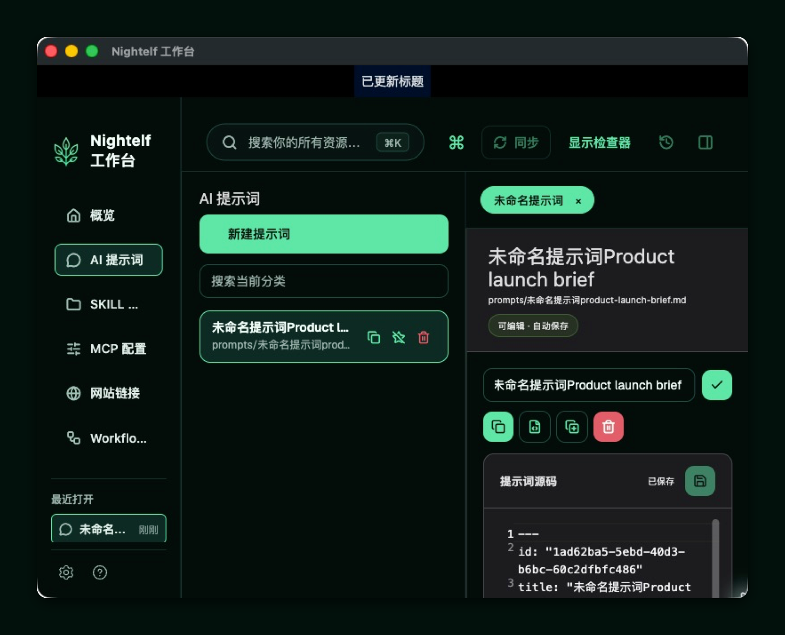

<p align="center">
  
</p>

<h1 align="center">Nightelf 工作台</h1>

<p align="center">
  <strong>本地优先的 macOS AI 资源工作台：把 Prompt · Skill · MCP · Link · Workflow 收进自己的 Vault，文件即真相。</strong><br>
  A local-first macOS workbench for the AI assets you want to keep portable, inspectable, and yours.
</p>

<p align="center">
  
  
  
</p>

<p align="center">
  <a href="docs/images/nightelf-workbench.png"></a>
</p>

<p align="center">如果 Nightelf 适合你的工作流，欢迎给仓库点一颗 Star。</p>

## Why Nightelf / 为什么是 Nightelf

Prompt、SKILL、MCP 配置、常用 AI 网站和 Workflow 很容易散落在聊天记录、下载目录和不同工具之间。Nightelf 用一个本地 Vault 把它们放回可浏览、可编辑、可迁移的文件结构中：你可以继续用 Finder、编辑器和 Git 处理自己的资产，而不是把核心内容锁进某个云端账号。

**In short:** Nightelf makes a local folder your AI asset library, so the files stay understandable and portable beyond the app.

> Nightelf 管理资源，不运行 MCP server，也不执行 Workflow；启动器是唯一例外，会把项目里的一键脚本交给 macOS 运行。

## Capabilities / 功能

- **Vault** — 创建或打开本地资源库；下次启动会恢复上次打开的 Vault，并在 macOS 上保留对用户选择目录的 security-scoped bookmark 访问。
- **Prompt** — 以 Markdown 保存提示词，支持创建、编辑、复制与回收站恢复。
- **Skill** — 导入含根级 `SKILL.md` 的文件夹，在应用中浏览和编辑文件，并提供 Finder / 终端入口。
- **MCP** — 保存和编辑 JSON 配置，提供 JSON 语法诊断与格式化；配置只作为文件管理，不会由 Nightelf 执行。
- **网站链接** — 保存链接资料，在内置浏览器中打开 HTTP(S) 页面，或通过 macOS 桌面悬浮球快速在外部打开。
- **Workflow** — 保存与编辑工作流文档，可在 Mermaid 源码与画布视图之间工作；Nightelf 不执行工作流。
- **启动器** — 在侧栏收集各项目的 `.sh` / `.command` 路径，点击启动后交给 macOS 运行；脚本文件仍留在原项目目录。
- **概览、搜索与元数据** — 从 Vault 总览进入资源，按标题、标签和可搜索文本查找；收藏、合集、描述、标签、关联资源与最近打开项随 Vault 保存。
- **macOS 使用路径** — 原生目录选择、上次 Vault 恢复、Finder / 终端快捷入口，以及网页悬浮球都围绕桌面文件工作流设计。

## Quick Start / 快速开始

需要在 **macOS** 上安装 Flutter SDK，并启用 Flutter macOS desktop 支持；Nightelf 不随仓库附带 Flutter，也不声明支持其他桌面或移动平台。

```bash
flutter pub get
flutter run -d macos
```

也可以用仓库脚本构建 Debug 包并打开应用：

```bash
./script/build_and_run.sh
```

首次启动时，选择「创建 Vault」或「打开 Vault」。创建会把所选文件夹作为资源库根目录；打开时选择包含 `.ai-vault.json` 的 Vault 根目录（即使先选中其下的资源子目录，应用也会定位回根目录）。

## Your Vault on Disk / 磁盘上的 Vault

Vault 是普通文件夹：资源文件可以被 Finder、编辑器和 Git 直接访问。当前应用创建并使用以下结构：

```text
my-nightelf-vault/
├── .ai-vault.json          # Vault 标识与版本
├── prompts/                # Markdown Prompt
├── skills/                 # SKILL 文件夹
├── mcp/                    # MCP JSON 配置
├── links/                  # 网站链接记录
├── workflows/              # Workflow 文档
├── launchers/              # 启动器记录（指向项目里的 .sh / .command）
└── .ai-workbench/          # 应用管理的收藏、合集、资源元数据、本地状态和画布布局
```

`.ai-workbench/` 是当前实现使用的应用管理状态目录；其 `local/` 内容会由 Vault 自带的 `.gitignore` 排除。资源本身仍保存在上方的类型目录中，因此可以按自己的工具和版本控制习惯继续维护。

## 可选 Git Vault 同步（两台电脑一致化）

Nightelf 默认 **不启用** Git 同步：只有你在当前 Vault 的「同步状态」里选择了启用，应用才会运行任何 `git` 命令。

### 准备远程仓库
1. 在 GitHub / GitLab / 自建 Git 等平台创建一个远程仓库（建议私有）。
2. 在仓库里确认你拿得到 `remote URL`（例如 `https://.../repo.git` 或 `git@...`）。

### 电脑 A：启用并先推一次
1. 打开你要同步的同一个 Vault（Vault 根目录）。
2. 在左侧或首页找到「**同步状态**」卡片。
3. 点击 `启用 Git 同步`，填写远程仓库 `Remote URL`。
4. （可选）按需打开：
   - `自动 pull：开启`：每次打开 Vault 时会自动执行 `git pull --rebase`。
   - `自动 push：开启`：当自动 pull 成功后再执行 `git push`（最佳努力，不阻塞打开 Vault）。
5. 点击 `立即同步`，把本机 Vault 内容推到远程。

### 电脑 B：启用后拉取 / 同步
1. 在电脑 B 打开同一个 Vault（同一套本地文件结构：Vault 根目录）。
2. 同样在「同步状态」里启用 Git 同步并填写同一个远程仓库。
3. 点击 `立即同步`（或打开 `自动 pull`），把远程内容拉回并与本地一致。

### 冲突处理（Conflict）
如果两台电脑同时修改导致 rebase 产生冲突：
1. 应用会弹出「同步冲突」对话框，显示受影响的文件列表与建议终端命令（例如：`cd "<你的 Vault 根目录>" && git status`）。
2. 你在终端手动解决冲突并完成提交后，再点对话框里的 `重试同步` 即可。

> 提示：如果你不想使用 Git，把「同步状态」保持 `未启用` 即可；Nightelf 不会自动执行任何 `git` 操作。

## Status / 当前状态

Nightelf 正在持续开发中。打包的 **Releases / DMG 下载：Coming soon**；目前请使用上面的 macOS 源码构建方式。

## Development / 开发

```bash
flutter test
flutter build macos --debug
```

## Contributing / 参与贡献

欢迎通过 [Issues](../../issues) 反馈问题、提出想法或讨论使用场景；也欢迎提交 [Pull Requests](../../pulls)，一起完善这个本地优先的 macOS 工作台。

## License / 许可证

项目许可证尚未发布；在仓库提供许可证文件之前，请先联系项目维护者确认使用与分发方式。

---

喜欢这种把 AI 资产留在自己手里的工作方式？欢迎 Star 支持 Nightelf。
