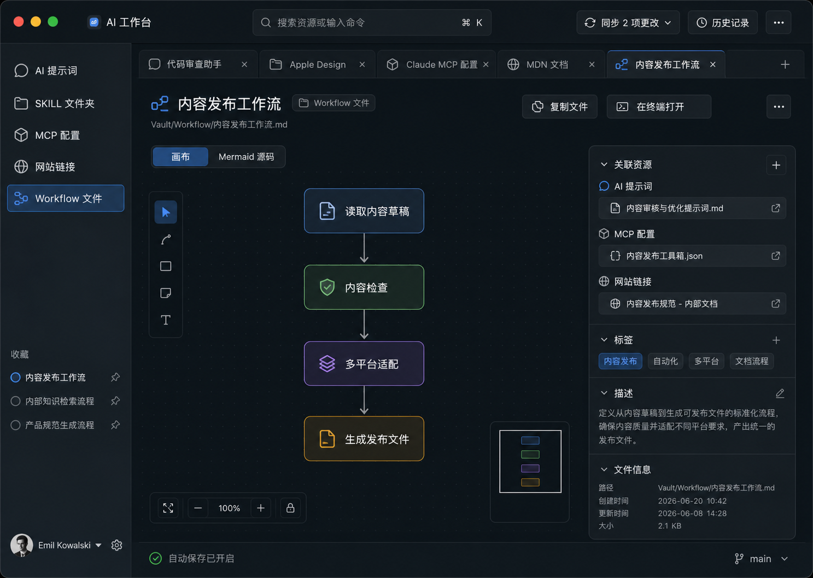

# AI 工作台 macOS Flutter 应用设计规格

日期：2026-08-08

状态：已确认，等待实施计划

目标平台：macOS

技术栈：Flutter

## 1. 产品定义

AI 工作台是一款本地优先的 macOS 私人 AI 资源管理软件。它将 AI 提示词、SKILL 文件夹、MCP 配置、网站链接和 Workflow 文件收纳到同一个可迁移、可搜索、可编辑、可关联且可使用 Git 同步的 Vault 中。

产品的核心价值是帮助用户在公司电脑和家庭电脑之间持续积累、整理与复用 AI 工作资产。应用只负责管理和编辑资源，不连接 MCP Server、不运行 Workflow，也不提供内置 AI 对话。

## 2. 设计目标

- 一个统一应用外壳承载五种专用工作区，跨类型资源可以同时作为标签页打开。
- Vault 中的核心内容保持为普通文件和文件夹，可被 Finder、Git、Cursor 和其他编辑器直接使用。
- 提供内置一键 Git 同步，同时保留 Finder、终端和外部浏览器入口。
- 同步遇到冲突时不自动覆盖，由作者在可视化审核界面中逐项确认。
- MCP 密钥、Token 和密码默认不进入 Git。
- 采用克制、熟悉、响应直接的 Apple 桌面设计语言，支持浅色、深色、高对比度与减少动态效果。
- 首版在约一万个小型文本资源的规模下仍保持可用的搜索和导航体验。

## 3. 非目标

- 不执行提示词、MCP Server、SKILL 或 Workflow。
- 不做应用账号、收费云同步、多用户实时协作或服务端存储。
- 不做完整浏览器产品、浏览器扩展、广告拦截或完整下载管理。
- 不实现 Obsidian 插件生态、知识图谱或 Canvas 的全部能力。
- 首版不保证无限画布上的所有结构编辑都能与任意 Mermaid 语法无损双向转换。
- 首版只交付 macOS，不交付 Windows、Linux、iOS 或 Android。

## 4. 已选视觉方向

选用深色 Apple 风格的“私人助理资源中心”方向，并扩展为统一 AI 工作台。窗口采用原生 macOS 交通灯、统一工具栏、半透明侧边栏、跨资源标签页、全局搜索、同步状态和主内容工作区。

视觉基准：



### 4.1 视觉原则

- 使用 macOS 系统字体和熟悉的桌面交互位置。
- 通过留白、字号、字重、对齐和分隔线建立层级，减少装饰性卡片。
- 半透明材质只用于侧边栏、标题栏和必要的浮动控件；编辑正文保持不透明和高可读性。
- 默认以深灰中性色和克制的蓝色焦点色为主，资源类型颜色仅用于小范围识别。
- 控件靠近其影响的内容，例如画布缩放控件位于画布内，复制动作位于文档标题附近。
- 动效立即响应、可中断且不过度弹跳；启用“减少动态效果”后使用短交叉淡入淡出。
- 支持窗口缩放、键盘操作、高对比度和减少透明度。

## 5. 信息架构与应用外壳

### 5.1 主导航

左侧边栏固定包含：

- AI 提示词
- SKILL 文件夹
- MCP 配置
- 网站链接
- Workflow 文件
- 收藏
- 最近使用

### 5.2 全局外壳

- 顶部统一工具栏包含 Vault 名称、全局搜索、`⌘K` 命令面板入口、Git 同步状态、历史记录与更多操作。
- 工具栏下方提供跨资源标签页。不同类型的资源可以并排保持打开状态。
- 主区域根据当前标签的资源类型加载对应工作区。
- 可选右侧检查器显示标签、描述、关联资源、路径、创建和更新时间等元数据。
- 底部状态栏显示自动保存状态、当前 Git 分支和本地/远端同步状态。

### 5.3 快捷操作

- `⌘K`：打开命令面板。
- `⌘P`：快速打开资源。
- `⌘S`：立即保存当前资源。
- `⌘⇧S`：启动一键同步。
- `⌘W`：关闭当前资源标签页。
- Return：打开列表中选中的资源。

## 6. 五种专用工作区

### 6.1 AI 提示词编辑器

- Markdown 源码、预览和可选双栏模式。
- 编辑标题、描述、标签和变量占位符。
- 自动保存、字数统计、复制全文、复制代码块和复制纯文本版本。
- 可以关联 SKILL、MCP、网站或 Workflow。
- 首版不提供 AI 对话、自动改写或提示词执行。

### 6.2 SKILL 工作区

- 展示完整文件树，默认优先打开 `SKILL.md`。
- Markdown、JSON、YAML、Shell 和其他文本文件使用共享编辑器。
- 支持导入整个文件夹、复制 Skill、在 Finder 显示和在终端打开。
- 原始目录结构保持不变；应用元数据放在独立 sidecar 文件中。
- 图片等常见附件可以预览；未知或二进制文件交给系统应用打开。

### 6.3 MCP 配置工作区

- JSON 编辑、格式化、行号与语法错误提示。
- 识别但不强制限制常见 `command`、`args`、`env` 和 server 字段。
- 提供“复制安全模板”“复制完整配置”和“在终端打开”。
- JSON 无效时保留内容，但“复制为有效配置”不可用。
- 首版只做 JSON 语法校验，不验证具体客户端 schema，也不连接或启动 Server。

### 6.4 网站工作区

- 基于 macOS WKWebView 在应用标签页内加载网站。
- 提供地址栏、后退、前进、刷新、复制链接和外部浏览器打开。
- 网站记录包含标题、URL、备注、标签和关联资源。
- Cookie 和登录状态只保存在当前电脑的 WebView 数据存储中，不进入 Vault 和 Git。
- 页面加载失败时提供重试与外部浏览器打开，不影响其他标签页。

### 6.5 Workflow 无限画布

- 支持 `.mmd`、包含 Mermaid 代码块的 `.md`，以及作为普通文本管理的 `.yaml` 和 `.json`。
- `.mmd` 提供“画布 / Mermaid 源码”双视图和即时预览。
- 画布支持无限平移、缩放、适配视图、框选、节点拖动和缩略图。
- 节点可以关联提示词、SKILL、MCP 或网站，点击后在新标签页打开。
- 手动节点位置、缩放、折叠和注释保存在独立布局文件中。
- Mermaid 源码错误时保留源码并继续显示最后一次有效画布。
- 首版通过源码创建、删除节点和修改连接；画布负责查看与布局，不承诺任意 Mermaid 语法的完全双向结构编辑。

## 7. Vault 文件设计

```text
AI-Workbench-Vault/
├── .ai-vault.json
├── prompts/
├── skills/
├── mcp/
├── links/
├── workflows/
├── assets/
├── .ai-workbench/
│   ├── favorites.json
│   ├── collections.json
│   ├── resources/
│   ├── workflow-layouts/
│   └── local/
└── .gitignore
```

### 7.1 文件职责

- `.ai-vault.json`：Vault 标记、格式版本、Vault ID 和显示名称。
- `prompts/`：带 YAML front matter 的 Markdown 提示词。
- `skills/`：完整保留的 SKILL 文件夹。
- `mcp/`：JSON 配置模板；资源元数据存放在 sidecar 文件中。
- `links/`：带 `url` front matter 的 Markdown 记录。
- `workflows/`：Mermaid、Markdown、YAML 或 JSON Workflow 文件。
- `assets/`：由资源明确引用的普通附件。
- `.ai-workbench/resources/`：不适合写入原文件的稳定 ID、标签、描述与关联关系。
- `.ai-workbench/workflow-layouts/`：按 Workflow 稳定 ID 保存画布布局。
- `.ai-workbench/local/`：搜索索引、缩略图和临时缓存，必须被 Git 忽略。

### 7.2 稳定标识与关联

每个资源拥有 UUID。允许写 front matter 的资源直接保存 UUID；MCP 和第三方 Skill 等不应被改写的资源使用 sidecar 元数据。收藏、集合和跨资源关联使用 UUID，不使用易受重命名影响的绝对路径。

资源移动或重命名后，索引器通过 UUID 重新定位。删除资源时，关联关系保留为可修复的“缺失引用”，直到作者删除或重新指向。

### 7.3 原子保存与外部编辑

- 编辑器使用防抖自动保存，并支持 `⌘S` 立即保存。
- 保存先写同目录临时文件，成功刷新到磁盘后原子替换目标文件。
- 文件监听器检测 Finder、Git 或外部编辑器产生的变化。
- 当前无未保存编辑时自动刷新；存在编辑时进入冲突审核，不静默覆盖。

## 8. Git 一键同步

### 8.1 支持范围

- 支持 GitHub、GitLab、Gitee 和任意标准 Git Remote。
- 首版通过系统 Git 命令执行，复用 SSH Key、Keychain 和系统 Credential Helper。
- 应用不保存 Git 密码或托管平台 Access Token。
- 未安装 Git、未配置 Remote 或认证失败时提供明确诊断和修复入口。

### 8.2 同步流程

1. 完成所有待保存内容并确认文件系统写入成功。
2. 运行敏感信息扫描和 Git 状态检查。
3. 将当前本地变更创建为一个同步检查点提交。
4. Fetch 远端分支。
5. 无分叉时 fast-forward 或直接推送。
6. 存在分叉时合并远端；无冲突则创建合并提交。
7. 存在冲突时停止同步并打开冲突审核。
8. 作者确认全部冲突结果后创建合并提交并推送。

一次同步只产生一个本地检查点提交，不因每次自动保存创建提交。

### 8.3 冲突审核

- 左侧展示冲突队列、文件路径和资源类型。
- 文本文件展示共同版本、本机版本和远端版本的三方差异。
- 作者可逐段选择本机、远端或手动合并。
- 整文件选择一方需要二次确认。
- Skill 文件夹按内部文件逐项审核。
- 二进制冲突允许保留本机、保留远端或同时保留并自动重命名。
- Workflow 源码与画布布局分别审核，不把布局选择误认为流程内容选择。
- 审核可中途退出；Git 冲突状态和三方内容保持可恢复。
- 只有所有冲突都被作者确认后才允许继续提交和推送。

## 9. 敏感信息保护

- MCP 配置默认保存 `${ENV_VAR}` 形式的安全模板。
- 真实秘密保存在 macOS Keychain 或被 `.gitignore` 排除的本机环境文件中。
- “复制配置”默认复制安全模板。
- “复制完整配置”需要单独确认并明确警告其中可能包含秘密。
- Git 提交前扫描常见 API Key、Token、私钥和高风险字段。
- 扫描发现风险时阻止同步，但不删除或修改作者文件。
- 作者可以对确认安全的特定命中创建明确忽略规则；忽略规则本身不包含秘密。

## 10. 技术架构

### 10.1 Flutter 模块

- `shell`：窗口、导航、标签页、命令面板和主题。
- `vault`：Vault 生命周期、文件监听、索引、元数据和资源关联。
- `editor`：共享文本/Markdown/结构化文本编辑能力。
- `prompts`、`skills`、`mcp`、`links`、`workflows`：五种资源适配器和工作区。
- `git_sync`：Git 状态、同步、历史、敏感信息扫描和冲突审核。
- `web_workspace`：独立 WKWebView 标签和本机浏览数据。
- `shared`：模型、错误类型、设计 token、快捷键和通用组件。

界面状态使用单向数据流的响应式状态管理。文件系统、Git、Keychain、WebView 和 Mermaid 渲染都隐藏在接口后，以便独立测试和替换实现。

### 10.2 Mermaid 与画布

Mermaid 渲染器使用随应用打包的本地资源，不从网络加载脚本。Flutter 与渲染器通过受限消息桥交换源码、布局和选中节点。网站 WebView 与 Mermaid 渲染环境使用不同的数据存储和权限边界，网页不能访问 Vault 文件或本地渲染器消息。

### 10.3 数据流


搜索索引是可重建的本地缓存，不是内容源。文件始终是唯一真实来源。

## 11. 异常处理

- 离线：保留本地修改并显示“等待同步”，不自动重试产生未知状态。
- Git 认证失败：保持文件和提交，显示 Remote、SSH 或 Credential Helper 检查入口。
- JSON 无效：保留文本并给出行列诊断，不允许宣称配置有效。
- Mermaid 无效：保留文本，显示错误并维持最后有效画布。
- 外部修改：复用冲突审核体验比较内存编辑与磁盘版本。
- WebView 加载失败：错误页提供重试和默认浏览器打开。
- 敏感信息命中：阻止提交，要求作者修改或明确忽略。
- 应用意外退出：依赖原子保存、最近自动保存内容和 Git 检查点恢复。
- 缺失关联：显示缺失资源，不自动删除关联或猜测新目标。

## 12. 性能与可访问性

- 文件树按需展开，Skill 子目录惰性加载。
- 搜索索引在后台增量更新，首轮扫描显示进度但不阻塞浏览已有结果。
- 编辑器保存、Mermaid 渲染和 Git 操作不占用 UI 主线程。
- 大型画布只更新可见区域，缩略图降低刷新频率。
- 长期未使用的网站标签允许释放 WebView，并保留 URL 和滚动恢复信息。
- 所有核心操作可通过键盘完成并拥有可读的辅助功能标签。
- 支持系统浅色/深色、高对比度、文字缩放、减少透明度和减少动态效果。

## 13. 验证策略

### 13.1 单元测试

- Vault 标记、路径与版本解析。
- Markdown front matter、sidecar 元数据与稳定 ID。
- URL、JSON 和 Mermaid 基础校验。
- 敏感信息检测与忽略规则。
- 原子保存、文件监听去抖和索引更新。

### 13.2 Git 集成测试

使用临时本地仓库覆盖：

- 初次设置 Remote 和正常同步。
- 本地领先、远端领先和双方分叉。
- 文本自动合并、文本冲突与作者审核。
- Skill 文件夹多文件冲突。
- 二进制冲突与同时保留。
- 离线、认证错误、同步中断和恢复。
- 敏感信息阻止提交。

### 13.3 Flutter 界面与视觉测试

- 五种工作区、跨资源标签页、搜索、收藏和关联资源。
- 复制操作、Finder/终端/外部浏览器打开。
- WebView 导航、Mermaid 错误与画布状态恢复。
- 冲突审核全过程。
- 浅色、深色、窗口缩放、高对比度、减少动态效果和减少透明度。

### 13.4 端到端验收

创建 Vault，分别添加五类资源，建立跨资源关联，完成编辑和搜索，在两个克隆之间制造冲突，由作者逐项审核，成功同步，然后重启应用并恢复上次 Vault、标签页与画布状态。

## 14. 首版交付范围

首版必须完成：

- 创建、打开和恢复一个当前 Vault。
- 五类资源的创建、导入、浏览、编辑、删除和关联。
- 全局搜索、收藏、标签、最近使用和跨资源标签页。
- Git Remote 设置、一键同步、历史和作者冲突审核。
- MCP 安全模板、Keychain/本机秘密边界和提交前扫描。
- 内置网站基础导航。
- Mermaid 源码、画布查看与手动布局。
- 原子保存、外部修改检测和恢复机制。
- Apple 风格的深浅色桌面界面与基础可访问性。

后续版本候选：

- 多 Vault 同时打开。
- 画布结构编辑与 Mermaid 源码的更完整双向转换。
- Windows 和 Linux。
- 可选的加密同步或团队协作。
- 更多 Workflow 格式解析器。

这些后续候选不属于首版验收条件。

## 15. 已确定的关键决策

- 存储：普通本地文件和文件夹，Git 仓库作为免费跨设备同步机制。
- 同步：应用内一键同步，同时保留在终端打开。
- 冲突：应用整理差异，作者最终确认，不静默覆盖。
- 安全：秘密不进入 Git，默认复制安全模板。
- Workflow：Mermaid 源码为核心内容，画布布局独立存储。
- 网站：应用内 WKWebView，登录状态仅本机保存。
- 产品边界：资源管理与编辑，不连接或执行资源。
- 视觉方向：已确认的深色 Apple 风格 AI 工作台。
